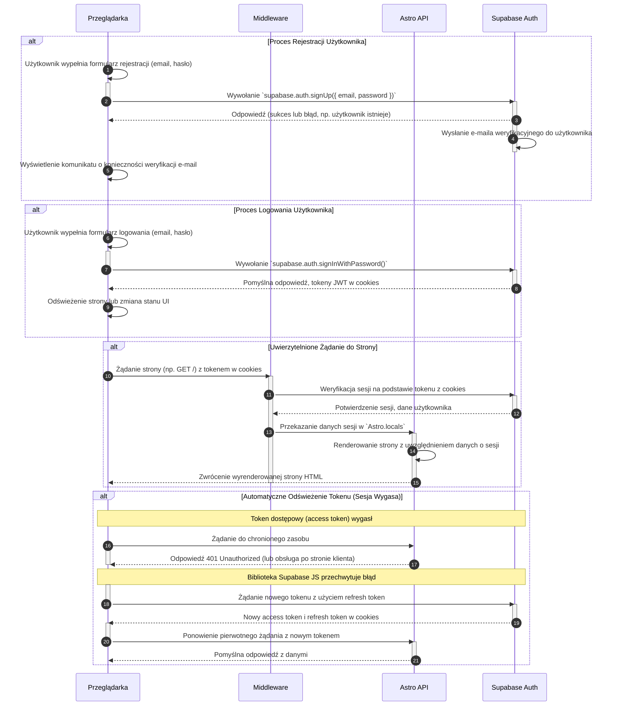

```mermaid
sequenceDiagram
    autonumber

    participant Przeglądarka
    participant Middleware
    participant Astro API
    participant Supabase Auth

    alt Proces Rejestracji Użytkownika

        Przeglądarka->>Przeglądarka: Użytkownik wypełnia formularz rejestracji (email, hasło)
        activate Przeglądarka
        Przeglądarka->>Supabase Auth: Wywołanie `supabase.auth.signUp({ email, password })`
        deactivate Przeglądarka
        activate Supabase Auth
        Supabase Auth-->>Przeglądarka: Odpowiedź (sukces lub błąd, np. użytkownik istnieje)
        Supabase Auth->>Supabase Auth: Wysłanie e-maila weryfikacyjnego do użytkownika
        deactivate Supabase Auth
        Przeglądarka->>Przeglądarka: Wyświetlenie komunikatu o konieczności weryfikacji e-mail

    end

    alt Proces Logowania Użytkownika

        Przeglądarka->>Przeglądarka: Użytkownik wypełnia formularz logowania (email, hasło)
        activate Przeglądarka
        Przeglądarka->>Supabase Auth: Wywołanie `supabase.auth.signInWithPassword()`
        deactivate Przeglądarka
        activate Supabase Auth
        Supabase Auth-->>Przeglądarka: Pomyślna odpowiedź, tokeny JWT w cookies
        deactivate Supabase Auth
        Przeglądarka->>Przeglądarka: Odświeżenie strony lub zmiana stanu UI

    end

    alt Uwierzytelnione Żądanie do Strony

        Przeglądarka->>Middleware: Żądanie strony (np. GET /) z tokenem w cookies
        activate Middleware
        Middleware->>Supabase Auth: Weryfikacja sesji na podstawie tokenu z cookies
        activate Supabase Auth
        Supabase Auth-->>Middleware: Potwierdzenie sesji, dane użytkownika
        deactivate Supabase Auth
        Middleware->>Astro API: Przekazanie danych sesji w `Astro.locals`
        activate Astro API
        Astro API->>Astro API: Renderowanie strony z uwzględnieniem danych o sesji
        Astro API-->>Przeglądarka: Zwrócenie wyrenderowanej strony HTML
        deactivate Astro API
        deactivate Middleware

    end

    alt Automatyczne Odświeżenie Tokenu (Sesja Wygasa)

        Note over Przeglądarka,Supabase Auth: Token dostępowy (access token) wygasł
        Przeglądarka->>Astro API: Żądanie do chronionego zasobu
        activate Przeglądarka
        Astro API-->>Przeglądarka: Odpowiedź 401 Unauthorized (lub obsługa po stronie klienta)
        deactivate Przeglądarka

        Note over Przeglądarka,Supabase Auth: Biblioteka Supabase JS przechwytuje błąd

        activate Przeglądarka
        Przeglądarka->>Supabase Auth: Żądanie nowego tokenu z użyciem refresh token
        deactivate Przeglądarka
        activate Supabase Auth
        Supabase Auth-->>Przeglądarka: Nowy access token i refresh token w cookies
        deactivate Supabase Auth

        activate Przeglądarka
        Przeglądarka->>Astro API: Ponowienie pierwotnego żądania z nowym tokenem
        deactivate Przeglądarka
        activate Astro API
        Astro API-->>Przeglądarka: Pomyślna odpowiedź z danymi
        deactivate Astro API

    end
```
