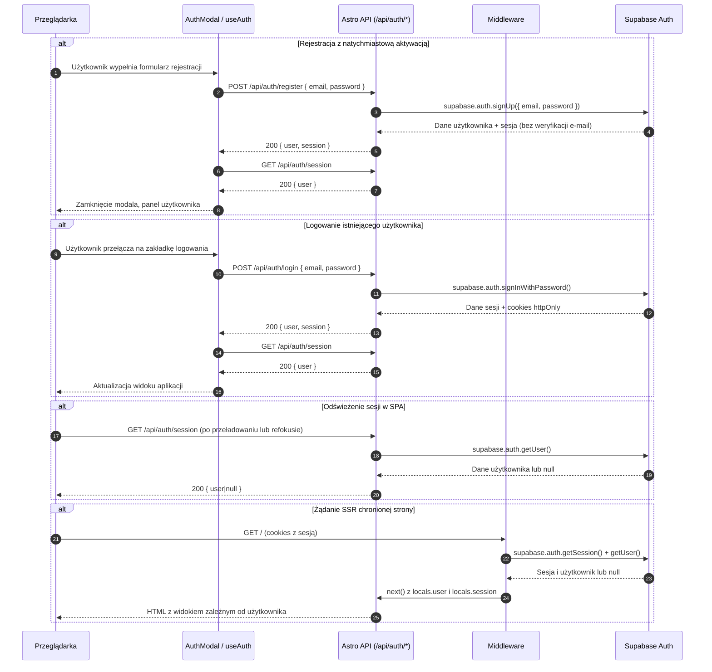

```mermaid
sequenceDiagram
    autonumber

    participant Browser as Przeglądarka
    participant Modal as AuthModal / useAuth
    participant API as Astro API (/api/auth/*)
    participant Middleware
    participant Supabase as Supabase Auth

    alt Rejestracja z natychmiastową aktywacją
        Browser->>Modal: Użytkownik wypełnia formularz rejestracji
        Modal->>API: POST /api/auth/register { email, password }
        API->>Supabase: supabase.auth.signUp({ email, password })
        Supabase-->>API: Dane użytkownika + sesja (bez weryfikacji e-mail)
        API-->>Modal: 200 { user, session }
        Modal->>API: GET /api/auth/session
        API-->>Modal: 200 { user }
        Modal-->>Browser: Zamknięcie modala, panel użytkownika
    end

    alt Logowanie istniejącego użytkownika
        Browser->>Modal: Użytkownik przełącza na zakładkę logowania
        Modal->>API: POST /api/auth/login { email, password }
        API->>Supabase: supabase.auth.signInWithPassword()
        Supabase-->>API: Dane sesji + cookies httpOnly
        API-->>Modal: 200 { user, session }
        Modal->>API: GET /api/auth/session
        API-->>Modal: 200 { user }
        Modal-->>Browser: Aktualizacja widoku aplikacji
    end

    alt Odświeżenie sesji w SPA
        Browser->>API: GET /api/auth/session (po przeładowaniu lub refokusie)
        API->>Supabase: supabase.auth.getUser()
        Supabase-->>API: Dane użytkownika lub null
        API-->>Browser: 200 { user|null }
    end

    alt Żądanie SSR chronionej strony
        Browser->>Middleware: GET / (cookies z sesją)
        Middleware->>Supabase: supabase.auth.getSession() + getUser()
        Supabase-->>Middleware: Sesja i użytkownik lub null
        Middleware->>API: next() z locals.user i locals.session
        API-->>Browser: HTML z widokiem zależnym od użytkownika
    end
```
