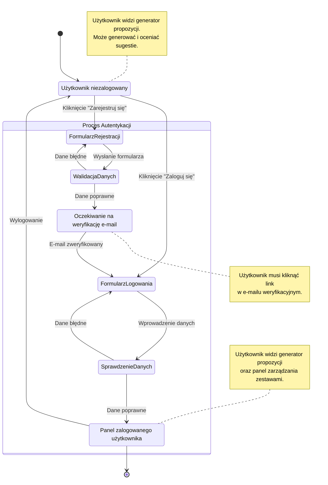

```mermaid
stateDiagram-v2
    [*] --> WidokNiezalogowany

    WidokNiezalogowany: Użytkownik niezalogowany
    note left of WidokNiezalogowany
        Użytkownik widzi generator propozycji.
        Może generować i oceniać sugestie.
    end note

    WidokNiezalogowany --> FormularzLogowania: Kliknięcie "Zaloguj się"
    WidokNiezalogowany --> FormularzRejestracji: Kliknięcie "Zarejestruj się"

    state "Proces Autentykacji" as Autentykacja {
        FormularzLogowania --> SprawdzenieDanych: Wprowadzenie danych

        state SprawdzenieDanych <<choice>>
        SprawdzenieDanych --> WidokZalogowany: Dane poprawne
        SprawdzenieDanych --> FormularzLogowania: Dane błędne

        FormularzRejestracji --> WalidacjaDanych: Wysłanie formularza

        state WalidacjaDanych <<choice>>
        WalidacjaDanych --> OczekiwanieNaWeryfikacje: Dane poprawne
        WalidacjaDanych --> FormularzRejestracji: Dane błędne

        OczekiwanieNaWeryfikacje: Oczekiwanie na weryfikację e-mail
        note right of OczekiwanieNaWeryfikacje
            Użytkownik musi kliknąć link
            w e-mailu weryfikacyjnym.
        end note
        OczekiwanieNaWeryfikacje --> FormularzLogowania: E-mail zweryfikowany
    }

    WidokZalogowany: Panel zalogowanego użytkownika
    note left of WidokZalogowany
        Użytkownik widzi generator propozycji
        oraz panel zarządzania zestawami.
    end note

    WidokZalogowany --> WidokNiezalogowany: Wylogowanie
    WidokZalogowany --> [*]

```
