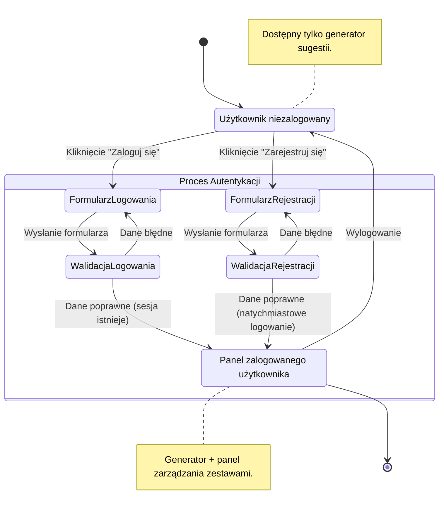

```mermaid
stateDiagram-v2
    [*] --> WidokNiezalogowany

    WidokNiezalogowany: Użytkownik niezalogowany
    note left of WidokNiezalogowany
        Dostępny tylko generator sugestii.
    end note

    WidokNiezalogowany --> FormularzLogowania: Kliknięcie "Zaloguj się"
    WidokNiezalogowany --> FormularzRejestracji: Kliknięcie "Zarejestruj się"

    state "Proces Autentykacji" as Autentykacja {
        FormularzLogowania --> WalidacjaLogowania: Wysłanie formularza

        state WalidacjaLogowania <<choice>>
        WalidacjaLogowania --> WidokZalogowany: Dane poprawne (sesja istnieje)
        WalidacjaLogowania --> FormularzLogowania: Dane błędne

        FormularzRejestracji --> WalidacjaRejestracji: Wysłanie formularza

        state WalidacjaRejestracji <<choice>>
        WalidacjaRejestracji --> WidokZalogowany: Dane poprawne (natychmiastowe logowanie)
        WalidacjaRejestracji --> FormularzRejestracji: Dane błędne
    }

    WidokZalogowany: Panel zalogowanego użytkownika
    note right of WidokZalogowany
        Generator + panel zarządzania zestawami.
    end note

    WidokZalogowany --> WidokNiezalogowany: Wylogowanie
    WidokZalogowany --> [*]
```
