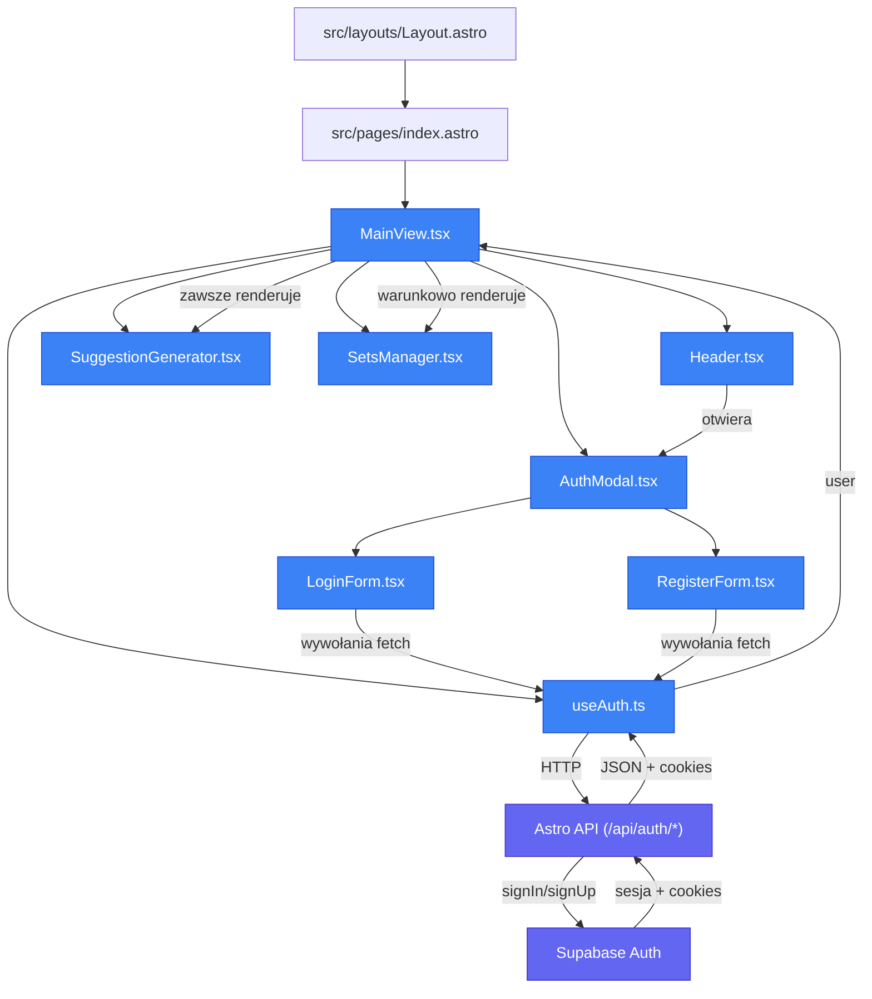

```mermaid
flowchart TD
    classDef client fill:#3b82f6,stroke:#1d4ed8,stroke-width:1px,color:#fff;
    classDef server fill:#6366f1,stroke:#4338ca,stroke-width:1px,color:#fff;

    Layout["src/layouts/Layout.astro"]
    IndexPage["src/pages/index.astro"]
    MainView["MainView.tsx"]:::client
    UseAuth["useAuth.ts"]:::client
    Header["Header.tsx"]:::client
    Generator["SuggestionGenerator.tsx"]:::client
    SetsManager["SetsManager.tsx"]:::client
    AuthModal["AuthModal.tsx"]:::client
    LoginForm["LoginForm.tsx"]:::client
    RegisterForm["RegisterForm.tsx"]:::client
    AuthAPI["Astro API (/api/auth/*)"]:::server
    Supabase["Supabase Auth"]:::server

    Layout --> IndexPage --> MainView
    MainView --> Header
    MainView --> Generator
    MainView --> SetsManager
    MainView --> AuthModal
    MainView --> UseAuth
    Header -- otwiera --> AuthModal
    AuthModal --> LoginForm
    AuthModal --> RegisterForm
    LoginForm -- wywołania fetch --> UseAuth
    RegisterForm -- wywołania fetch --> UseAuth
    UseAuth -- HTTP --> AuthAPI
    AuthAPI -- signIn/signUp --> Supabase
    Supabase -- sesja + cookies --> AuthAPI
    AuthAPI -- JSON + cookies --> UseAuth
    UseAuth -- user --> MainView
    MainView -- warunkowo renderuje --> SetsManager
    MainView -- zawsze renderuje --> Generator
```
