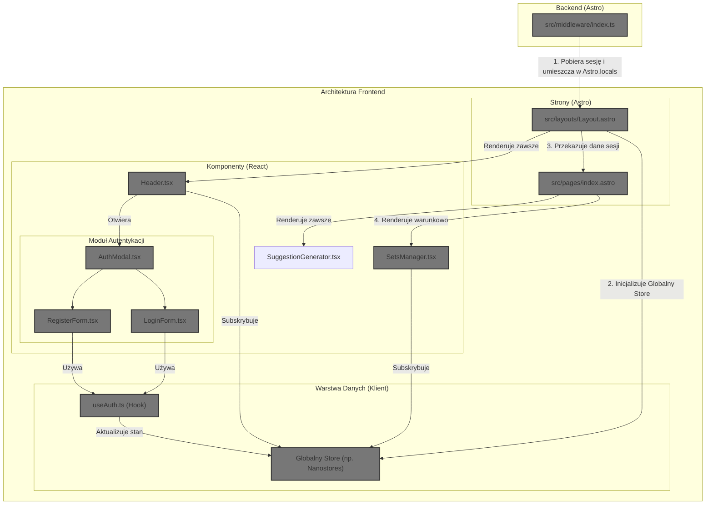

```mermaid
flowchart TD
    classDef updated fill:#777,stroke:#333,stroke-width:2px;

    subgraph "Backend (Astro)"
        Middleware["src/middleware/index.ts"]:::updated
    end

    subgraph "Architektura Frontend"
        subgraph "Warstwa Danych (Klient)"
            direction LR
            GlobalStore["Globalny Store (np. Nanostores)"]:::updated
            AuthHook["useAuth.ts (Hook)"]:::updated
        end

        subgraph "Strony (Astro)"
            Layout["src/layouts/Layout.astro"]:::updated
            IndexPage["src/pages/index.astro"]:::updated
        end

        subgraph "Komponenty (React)"
            Header["Header.tsx"]:::updated
            SuggestionGenerator["SuggestionGenerator.tsx"]
            SetsManager["SetsManager.tsx"]:::updated

            subgraph "Moduł Autentykacji"
                AuthModal["AuthModal.tsx"]:::updated
                LoginForm["LoginForm.tsx"]:::updated
                RegisterForm["RegisterForm.tsx"]:::updated
            end
        end
    end

    Middleware -- "1. Pobiera sesję i umieszcza w Astro.locals" --> Layout
    Layout -- "2. Inicjalizuje Globalny Store" --> GlobalStore
    Layout -- "3. Przekazuje dane sesji" --> IndexPage
    IndexPage -- "4. Renderuje warunkowo" --> SetsManager
    IndexPage -- "Renderuje zawsze" --> SuggestionGenerator
    Layout -- "Renderuje zawsze" --> Header

    Header -- "Subskrybuje" --> GlobalStore
    SetsManager -- "Subskrybuje" --> GlobalStore

    Header -- "Otwiera" --> AuthModal
    AuthModal --> LoginForm
    AuthModal --> RegisterForm

    LoginForm -- "Używa" --> AuthHook
    RegisterForm -- "Używa" --> AuthHook
    AuthHook -- "Aktualizuje stan" --> GlobalStore
```
